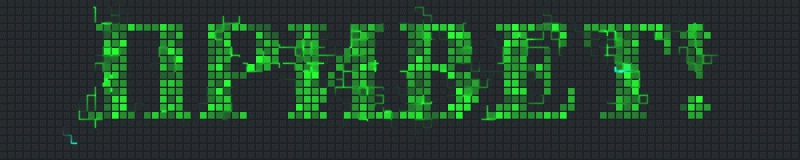

    

Более 2,5 лет занимаюсь обеспечением качества web-приложений. Люблю изучать новые технологии и совершенствовать свои текущие навыки.

На данный момент активно изучаю Java (javarush) и прошел курс по автоматизированному тестированию от [QA.GURU](https://qa.guru/) Успешно применяю полученные навыки на практике как QA Automation.

##  Мои проекты

##  Технологический стек

##  Контакты

